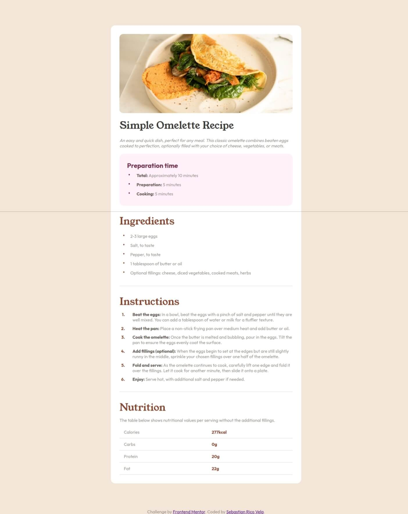
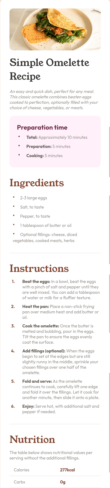

# Frontend Mentor - Recipe page solution

This is a solution to the [Recipe page challenge on Frontend Mentor](https://www.frontendmentor.io/challenges/recipe-page-KiTsR8QQKm).

## Table of contents

- [Frontend Mentor - Recipe page solution](#frontend-mentor---recipe-page-solution)
  - [Table of contents](#table-of-contents)
  - [Overview](#overview)
    - [Screenshot](#screenshot)
    - [Links](#links)
    - [Built with](#built-with)
    - [What I learned](#what-i-learned)
  - [Author](#author)

## Overview
This is a simple page to practice HTML and CSS. The challenge comes from the Frontend Mentor page. 

### Screenshot





### Links
- Solution URL: [Link](https://recipepage-agilepanda482.netlify.app/)

### Built with
- HTML5
- CSS
- Flexbox
- Mobile-first workflow

### What I learned
This page was a lot of fun to create, and I learned how to use the ```main``` and ```container``` tags, as well as the ```section``` tags.

It was an easy page to practice my frontend knowledge.

## Author
- Frontend Mentor - [@AgilePanda482](https://www.frontendmentor.io/profile/AgilePanda482)
- Linkedin - [@AgilePanda482](https://www.linkedin.com/in/AgilePanda482/)
